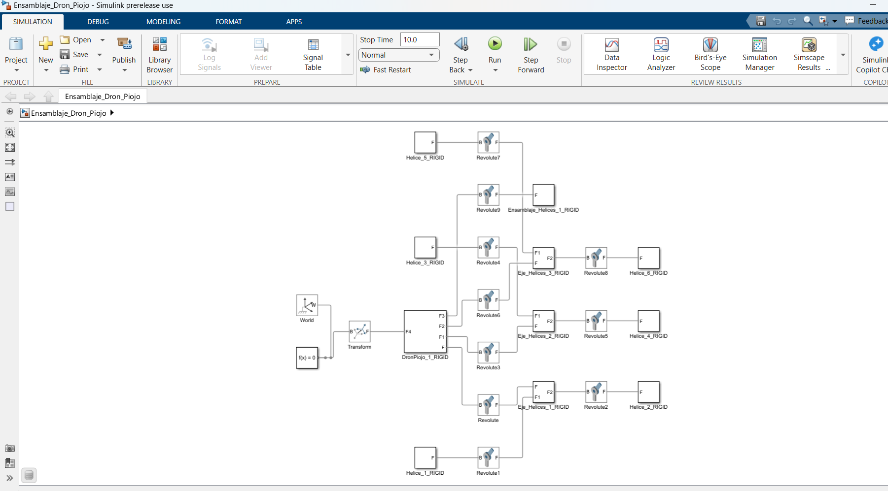
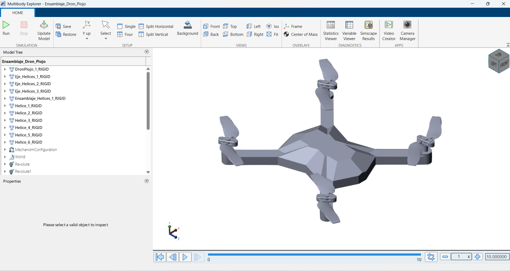

# GrupoC_DroneRacing

## Ingeniería Control
Se realizó un gemelo digital en **MATLAB** utilizando **Simulink**. Para ello se desarrolló un modelo compuesto por varios bloques de subsistemas, cada uno encargado de una función específica del sistema.

Los principales bloques implementados fueron:

- **Interfaz de comunicación**, encargada de recibir las entradas del usuario.
- **Control**, donde se implementó un controlador PID para mejorar la estabilidad del sistema.
- **Dinámica física**, responsable de calcular trayectorias, fuerzas, torques y ángulos considerando los efectos de la gravedad.
- **Visualización**, donde se representa gráficamente el movimiento del dron mediante un modelo tridimensional.

### Interfaz

En el bloque de **Entrada** se implementaron dos formas de controlar el dron:

- **Desde la computadora**, ejecutando el programa `Mando.m`.
- **Mediante un control de Xbox**, conectado a la computadora. MATLAB reconoce automáticamente el dispositivo, permitiendo utilizarlo como método de control del dron.

### Control PID

El bloque de **Control** implementa un controlador **PID**, cuya función es mantener la estabilidad del dron en los ángulos de orientación y en la velocidad del eje **Z**.

Este bloque recibe las señales provenientes del dispositivo de control, las procesa y calcula la fuerza que debe generar cada motor para mantener el equilibrio del sistema.

La misma lógica de control fue utilizada posteriormente en el dron físico, donde el controlador emplea la información proporcionada por la **MPU** para realizar correcciones en tiempo real y mantener una mayor estabilidad durante el vuelo.

Durante el desarrollo se realizaron múltiples ajustes a las constantes del controlador PID con el objetivo de obtener la mejor respuesta posible del sistema.

### Dinámica

El bloque de **Dinámica** está compuesto por diferentes subsistemas encargados de calcular las fuerzas y torques que actúan sobre el sistema de referencia del dron.

Además, se implementó un bloque para considerar el efecto de la **gravedad**, el cual se encuentra retroalimentado por el bloque **6DOF (Seis Grados de Libertad)**. Este bloque es el responsable de calcular la trayectoria, la posición y la orientación del dron a partir de la dinámica del sistema.

### Visualización

Finalmente, las salidas generadas por el bloque **6DOF** son agrupadas en un vector que es utilizado por una función encargada de abrir una ventana de visualización.

En esta interfaz se representa:

- La trayectoria recorrida por el dron.
- La orientación del vehículo durante la simulación.
- Un modelo tridimensional del dron desarrollado en **SolidWorks** e importado en formato **STL**.

## Ingeniería Comunicaciones

## Ingeniería Eléctrica 

## Ingeniería Mecánica

### Ingeniería Inversa
En la parte de Ingeniería Mecánica se llevó a cabo un proceso de ingeniería inversa sobre un dron KE88 de la marca Kiwo, el cual fue adquirido para su análisis. Primero se realizó el desarme del equipo para identificar y extraer los componentes internos, lo que permitió comprender su estructura y funcionamiento. Posteriormente, dentro del trabajo asignado a la ingeniería mecánica, se modelaron en SolidWorks las distintas piezas del dron, desde las hélices hasta la carcasa, con el objetivo de recrear de forma precisa el diseño original. Este proceso permitió obtener un mejor conocimiento del sistema mecánico del dron, así como de la relación entre sus componentes y su funcionamiento general.
#### 1. Desarmado del drón:

#### 2. Medición de piezas:

#### 3. Modelado de piezas:

### Modelado de Dron y Simulación Dinámica

Una vez concluida la fase de ingeniería inversa y teniendo el modelo base ensamblado en SolidWorks, el siguiente paso fue llevar el sistema físico a un entorno de simulación para analizar su dinámica y facilitar el futuro diseño del sistema de control. Para ello, realizamos una exportación a **MATLAB / Simulink** utilizando la herramienta **Simscape Multibody**.

El proceso de integración consistió en los siguientes pasos:

1. **Exportación desde SolidWorks:** Utilizando el plugin *Simscape Multibody Link*, exportamos el ensamblaje completo. Este proceso extrae automáticamente las propiedades físicas del modelo CAD (masa, centro de gravedad, momentos de inercia de cada pieza) y genera un archivo `.xml` junto con las geometrías tridimensionales asociadas.
2. **Importación a MATLAB:** A través del comando `smimport` en la ventana de comandos de MATLAB, leímos el archivo `.xml` generado previamente. 
3. **Generación del Diagrama de Bloques:** Simulink interpretó la información y construyó de forma automática el diagrama de bloques del sistema multicuerpo. 

**Estructura del modelo en Simscape:**
El diagrama resultante traduce fielmente las relaciones mecánicas del dron:
* **Sólidos (Rigid Solids):** Representan el chasis principal y cada una de las hélices, conservando la masa y geometría real del dron.
* **Articulaciones (Revolute Joints):** Las relaciones de posición (mates) creadas en SolidWorks se transformaron en juntas de revolución, las cuales representan el eje de giro de cada uno de los 4 motores, permitiendo el movimiento independiente de cada hélice.
* **Marco de Referencia:** El sistema cuenta con un bloque de configuración de mecanismo que define las leyes de la física (como la gravedad) sobre las cuales interactuará el dron durante las pruebas.

Este modelo base en Simulink es fundamental, ya que nos permitirá inyectar señales a los motores, simular el comportamiento en vuelo y probar los algoritmos de control (PID) antes de implementarlos en el hardware físico.

## Ingeniería Software

