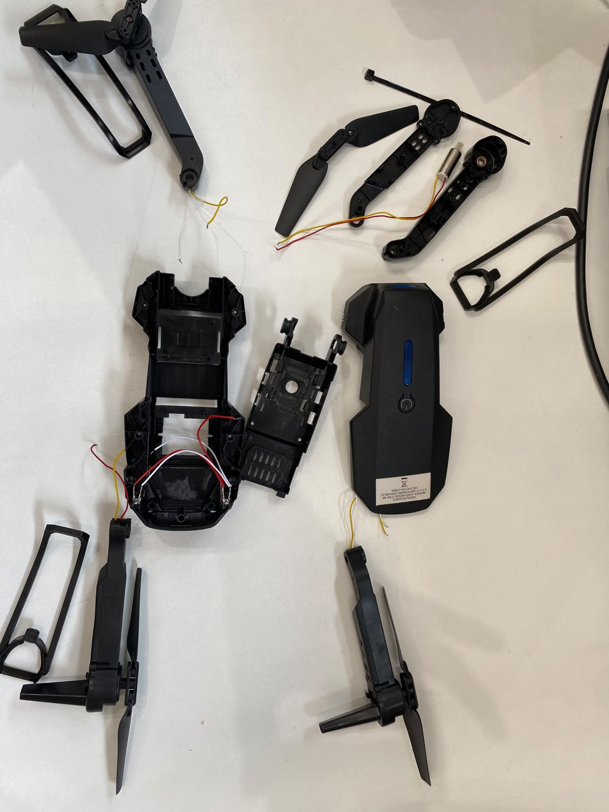
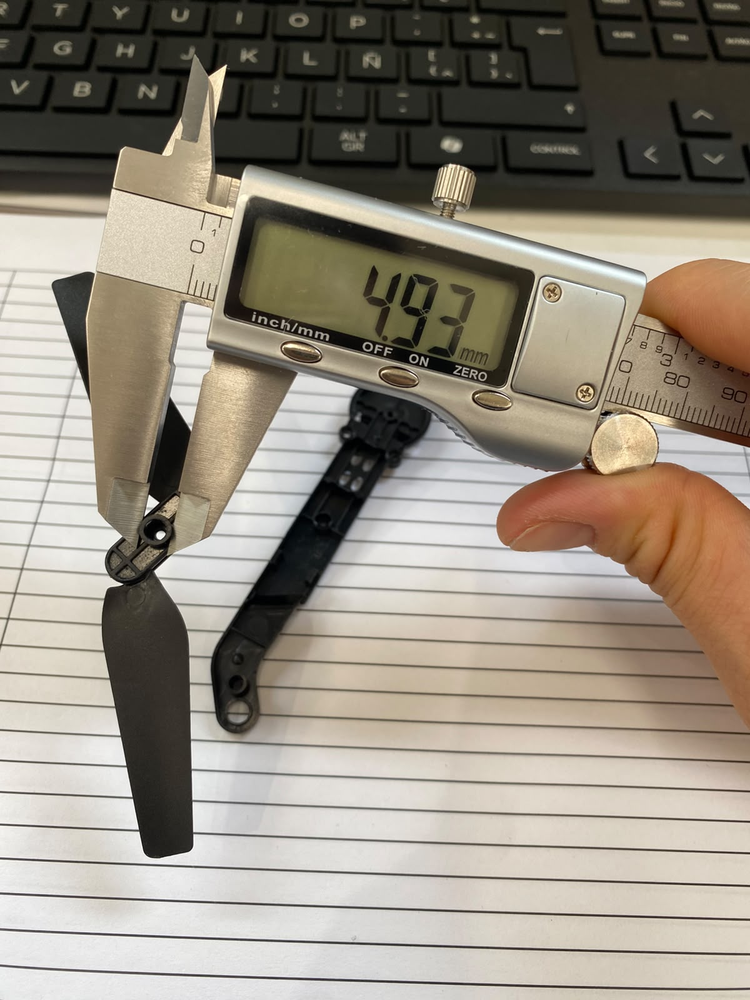
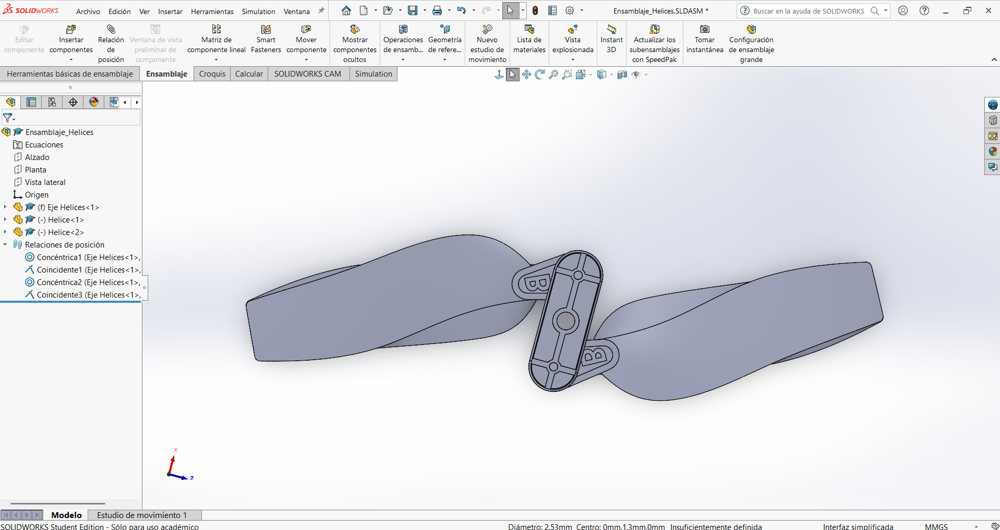

# GrupoC_DroneRacing

## Ingeniería Control

## Ingeniería Comunicaciones

## Ingeniería Eléctrica 

## Ingeniería Mecánica

### Ingeniería Inversa
En la parte de Ingeniería Mecánica se llevó a cabo un proceso de ingeniería inversa sobre un dron KE88 de la marca Kiwo, el cual fue adquirido para su análisis. Primero se realizó el desarme del equipo para identificar y extraer los componentes internos, lo que permitió comprender su estructura y funcionamiento. Posteriormente, dentro del trabajo asignado a la ingeniería mecánica, se modelaron en SolidWorks las distintas piezas del dron, desde las hélices hasta la carcasa, con el objetivo de recrear de forma precisa el diseño original. Este proceso permitió obtener un mejor conocimiento del sistema mecánico del dron, así como de la relación entre sus componentes y su funcionamiento general.
#### 1. Desarmado del drón:

#### 2. Medición de piezas:

#### 3. Modelado de piezas:

### Modelado de Dron
Hacemos un modelo báse para subirlo al modelado de Matlab

## Ingeniería Software

